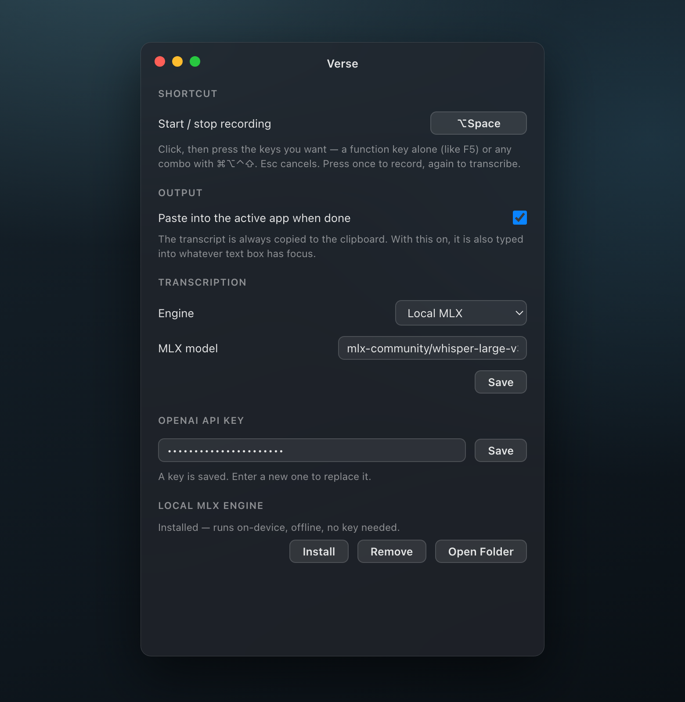
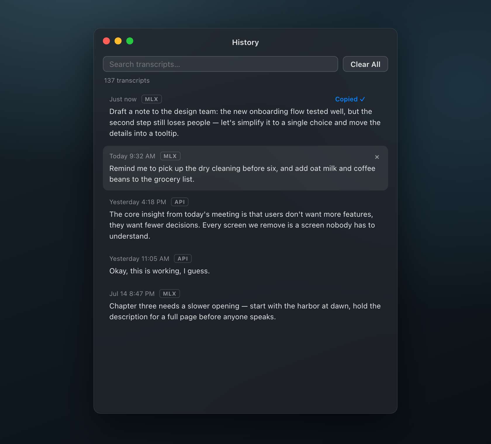

# Verse

*Speak. It becomes Verse.*

A macOS menu bar app for voice transcription, through the OpenAI API or a local Whisper model. Press the shortcut (**⌥Space** by default, configurable in Settings) — a small translucent panel drops down from the menu bar. Press again and your words are transcribed, copied to the clipboard, and pasted straight into whatever text box has focus. Esc cancels a recording.


The menu bar mark — a Didot closing quote — shows the current state: **”** idle, a red dot recording, **…** transcribing. The History window keeps your past transcripts, searchable, one click to copy.

| Settings — local or API engine, shortcut, auto-paste | History — search, copy, delete |
| :---: | :---: |
|  |  |

## Download

A prebuilt `.dmg` for Apple Silicon is on the [Releases page](https://github.com/LMC4S/macOS-whisper/releases).

The app is not signed or notarized, so on first launch right-click the app and choose Open, or allow it under System Settings > Privacy & Security.

## Transcription engines

**OpenAI API** — requires an API key and internet. Files are sent to OpenAI's servers.

**Local MLX** — runs on your Mac, offline, no API key needed. Apple Silicon only. The app manages its own Python environment and pulls models from Hugging Face on first use.

Default model: `mlx-community/whisper-large-v3-turbo`. Any compatible model from [mlx-community](https://huggingface.co/mlx-community) works — swap it in Settings.

## Requirements

- macOS (Apple Silicon required for the local engine)
- Node.js 18+
- Python 3, Homebrew or system (local engine only)

## Run from source

```sh
npm install
npm start
```

## Build

```sh
npm run dist
```

## Setup

**OpenAI:** open Settings from the menu bar icon, paste your API key, select OpenAI as the engine.

**Local MLX:** open Settings, select Local MLX, click Install. The first transcription also downloads the model weights (1–3 GB depending on the model).

**Auto-paste:** the first time Verse pastes into another app, macOS asks you to allow it under System Settings → Privacy & Security → Accessibility. Until then it falls back to clipboard-only.

Settings and transcript history are stored in Electron's user data directory (`~/Library/Application Support/Verse`).

## License

[AGPL-3.0](LICENSE)
