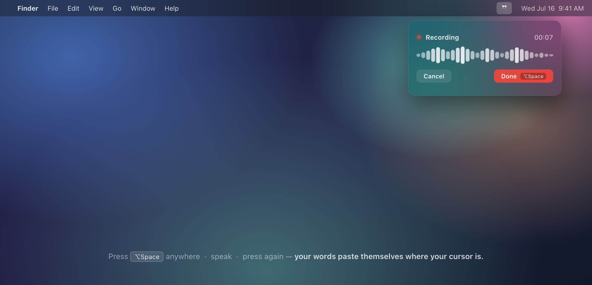
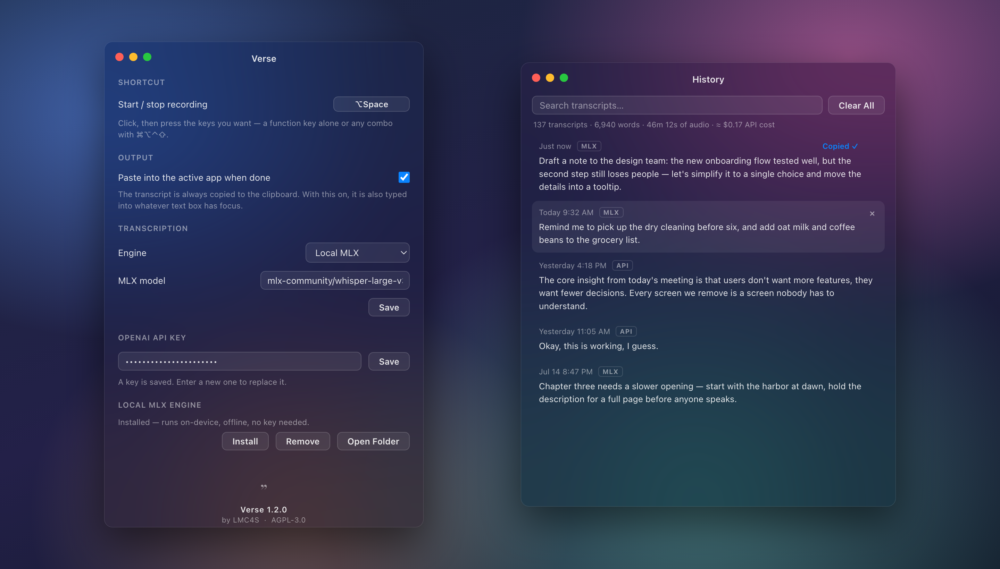

# Verse — Whisper that lives in the menu bar

A lightweight macOS app for voice transcription that stays out of the way: a quote mark in the menu bar, a translucent panel while recording, and finished text wherever the cursor sits. One shortcut (**⌥Space** by default, configurable) starts and ends a recording; the transcript lands on the clipboard and is pasted into the focused text field. Transcription runs on Whisper — through the OpenAI API, or fully on-device with a local MLX model. Esc cancels.



The menu bar mark shows the current state: **”** idle, a red dot recording, **…** transcribing. Past transcripts are kept in a searchable History window — click an entry to copy it.



## Install

With [Homebrew](https://brew.sh):

```sh
brew install --cask lmc4s/tap/verse
```

Or grab `Verse-x.y.z-arm64.dmg` (Apple Silicon) from the [Releases page](https://github.com/LMC4S/verse/releases).

The app is not signed or notarized, so on first launch right-click the app and choose Open, or allow it under System Settings > Privacy & Security. On first use, macOS will also ask for Microphone access, and for Accessibility if auto-paste is on.

## Transcription engines

**OpenAI API** — requires an API key and internet. Files are sent to OpenAI's servers.

**Local MLX** — runs on your Mac, offline, no API key needed. Apple Silicon only. The app manages its own Python environment and pulls models from Hugging Face on first use.

Default model: `mlx-community/whisper-large-v3-turbo`. Any compatible model from [mlx-community](https://huggingface.co/mlx-community) works — swap it in Settings.

## Requirements

- macOS (Apple Silicon required for the local engine)
- Node.js 18+
- Python 3, Homebrew or system (local engine only)

## Run from source

```sh
npm install
npm start
```

## Build

```sh
npm run dist
```

## Setup

**OpenAI:** open Settings from the menu bar icon, paste your API key, select OpenAI as the engine.

**Local MLX:** open Settings, select Local MLX, click Install. The first transcription also downloads the model weights (1–3 GB depending on the model).

**Auto-paste:** the first time Verse pastes into another app, macOS asks you to allow it under System Settings → Privacy & Security → Accessibility. Until then it falls back to clipboard-only.

Settings and transcript history are stored in Electron's user data directory (`~/Library/Application Support/Verse`).

## Compared with macOS dictation

macOS has built-in dictation (the 🎤 / F5 key) that types at the cursor and runs on-device on Apple Silicon. For a quick sentence of clear English it is fast and accurate. Verse covers different ground:

- Whisper holds up on accents, background noise, technical vocabulary, and about 100 languages (Apple's dictation supports roughly 30 locales).
- A choice of engine — OpenAI's API or a fully offline local model — and the model itself is swappable.
- Every transcript is kept: searchable history with word, duration, and cost totals, one click to copy again.
- A visible recording panel with cancel, a shortcut of your choosing, and the same behavior in every app.

## Privacy

Verse has no telemetry or accounts; the DMG is a packaged build of this repository. Audio is recorded only while a recording is active. The Local MLX engine runs entirely on-device; the OpenAI engine sends audio to OpenAI for transcription. Settings and history are plain JSON files in the user data folder.

## License

[AGPL-3.0](LICENSE)
